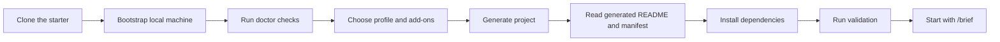

# SPEC-DRIVEN DEVELOPMENT STARTER PACK
### :rocket: Launch spec-driven, multi-agent projects with safer defaults.

An open source starter platform for teams and solo builders who want a practical way to begin new projects with clear workflow contracts, guided onboarding, portable setup, and room to grow into smarter orchestration over time.

SPEC-DRIVEN DEVELOPMENT STARTER PACK is based on the methodology introduced in GitHub's [spec-kit](https://github.com/github/spec-kit), with additional work here to expand that foundation into a more complete starter platform for onboarding, workflow governance, reusable profiles, and portable project setup.

[](https://github.com/williamceccon/spec-driven-development-starter-pack/releases)
[](LICENSE)
[](#supported-platforms)
[](#profile-catalog)

> :compass: **Repo-first workflow contract**  
> :sparkles: **Reusable profiles and add-ons**  
> :robot: **Agent-friendly prompts and governance**  
> :seedling: **Beginner-friendly onboarding and setup**

`idea` :arrow_right: `spec` :arrow_right: `plan` :arrow_right: `build`

---

## :card_index_dividers: Table of Contents

- [:toolbox: What It Is](#what-it-is)
- [:bulb: Why This Pack Exists](#why-this-pack-exists)
- [:triangular_ruler: Proposed Architecture](#proposed-architecture)
- [:rocket: Get Started](#get-started)
- [:seedling: Beginner-Friendly Onboarding](#beginner-friendly-onboarding)
- [:twisted_rightwards_arrows: Generated Flow](#generated-flow)
- [:open_file_folder: Profile Catalog](#profile-catalog)
- [:jigsaw: Add-on Catalog](#add-on-catalog)
- [:books: Curated Skills](#curated-skills)
- [:computer: Supported Platforms](#supported-platforms)
- [:gear: Supported Workspaces and Agents](#supported-workspaces-and-agents)
- [:open_file_folder: Repository Layout](#repository-layout)
- [:world_map: Roadmap](#roadmap)
- [:bookmark_tabs: Documentation](#documentation)
- [:page_facing_up: License](#license)

## :toolbox: What It Is

SPEC-DRIVEN DEVELOPMENT STARTER PACK helps you create new repositories with:

- a repo-first workflow contract
- guided project generation with beginner-safe defaults
- reusable profiles for common project shapes
- composable add-ons for databases and orchestration bundles
- generated docs, prompts, environment templates, and workflow governance

The stable source of truth in generated projects is:

- `workflow-pack.json`
- `.workflow-pack/manifest.json`
- `AGENTS.md`
- `CLAUDE.md`
- `.github/copilot-instructions.md`

Tool-specific prompts are generated from that contract instead of becoming the contract themselves.

This repository builds on the spec-driven method from GitHub's [spec-kit](https://github.com/github/spec-kit), then extends it with a fuller starter-pack experience for setup, profile composition, add-ons, and operational guidance.

## :bulb: Why This Pack Exists

Many new projects fail at the boring but critical setup layer: inconsistent environments, unclear GitHub setup, missing CI, no shared workflow rules, and too much hidden knowledge about how the team expects agents to work.

This starter pack is designed to reduce that friction by giving every new project:

- a portable core workflow layer
- a selected project profile
- optional add-ons for common capabilities
- curated repo-local fallback skills
- beginner-friendly instructions for environment, CI, dependencies, and first steps

The goal is not only to help you generate code faster. The goal is to help you start a repository that can still be understood, maintained, and evolved after the first burst of AI-assisted momentum.

## :triangular_ruler: Proposed Architecture

The pack uses a layered architecture so that project shape, optional capabilities, and agent surfaces can evolve without turning the repository into prompt sprawl.

### :building_construction: Architecture tiers

| Tier | Owns | Why it exists | Limit |
| --- | --- | --- | --- |
| `workflow contract` | `workflow-pack.json`, `.workflow-pack/manifest.json`, governance docs | Keeps the repo, not the tool, as the source of truth | Can become too generic if a large org needs many incompatible workflows |
| `profile` | project shape, default commands, validation, CI shape, env conventions | Gives each new repo a clear starter identity | Assumes one dominant project style per generated repo |
| `add-on` | optional capabilities such as database contracts or orchestration bundles | Lets you compose common concerns without duplicating whole profiles | Works best for additive concerns, not deep architectural rewrites |
| `workspace surface` | Codex, Claude Code, OpenCode, GitHub Copilot, Antigravity outputs | Mirrors the same repo contract across multiple agent systems | Vendor-specific features can drift faster than the shared repo contract |

### :compass: Why this architecture

- The repository remains the stable center, even if your preferred AI workspace changes.
- Profiles solve the "blank repo" problem by giving each project a concrete shape from day one.
- Add-ons keep optional concerns modular, so you do not need a separate profile for every combination.
- Generated agent surfaces reduce repeated setup work while keeping prompts synchronized with the same project contract.

### :warning: Tier limits and scaling difficulties

This architecture is intentionally strong for `single repos`, `small teams`, `solo builders`, and `medium-complexity products`. It starts to feel more constrained when:

- a repo becomes a large monorepo with multiple teams and conflicting workflow needs
- one generated repo needs to support several equally important product shapes at once
- add-ons begin to depend on each other in non-additive ways
- agent vendors diverge enough that one shared contract no longer fits all of them cleanly

In practice, the likely scaling pain points are:

- `contract pressure`: one `workflow-pack.json` can become too broad if the repo represents many sub-products
- `profile pressure`: a profile can stop being expressive enough once the stack becomes highly specialized
- `add-on pressure`: combinations are easy when concerns are simple, but harder when infra choices interact deeply
- `surface pressure`: generated prompts stay aligned only if the repo contract stays disciplined

For that reason, this pack is best seen as a strong bootstrap architecture, not a promise that every large-scale evolution can remain fully declarative forever.

## :rocket: Get Started

### :inbox_tray: 1. Clone the repository

```bash
git clone https://github.com/williamceccon/spec-driven-development-starter-pack.git
cd spec-driven-development-starter-pack
```

### :wrench: 2. Bootstrap your machine

Windows:

```powershell
./scripts/bootstrap.ps1
./scripts/install-workflow-pack.ps1
./scripts/doctor.ps1
```

macOS / Linux:

```bash
bash ./scripts/bootstrap.sh
bash ./scripts/install-workflow-pack.sh
bash ./scripts/doctor.sh
```

### :building_construction: 3. Generate a new project

Interactive:

```powershell
./scripts/new-project.ps1
```

```bash
bash ./scripts/new-project.sh
```

Non-interactive:

```powershell
./scripts/new-project.ps1 -Name demo-api -TargetPath C:\path\to\projects -Profile python-api -Addons postgres,core-workflow
```

```bash
bash ./scripts/new-project.sh --name demo-api --target-path "$HOME/projects" --profile python-api --addons postgres,core-workflow
```

### :footprints: 4. Follow the generated README

Inside the generated repository:

1. Read `README.md`
2. Copy `.env.example` to `.env`
3. Install dependencies using the generated commands
4. Run the first validation command
5. Start your workflow with `/brief "initial feature idea"`

## :seedling: Beginner-Friendly Onboarding

This pack is intentionally built for people using spec-driven development or agent-assisted development for the first time.

Generated projects include:

- a profile-specific `README.md`
- `.env.example`
- install, run, and validation commands
- a first-30-minutes checklist
- GitHub repository creation and push instructions
- optional GitHub Actions CI setup

If you are new to GitHub, env files, or dependency installation, the generated docs are designed to explain the basics instead of assuming them.

## :twisted_rightwards_arrows: Generated Flow



## :open_file_folder: Profile Catalog

Profiles define the base identity of a generated repository. A profile chooses the default project shape, starter files, install commands, validation defaults, env conventions, skill bundle, and CI direction.

### :gear: How profiles work

Each profile answers the question: "What kind of repo am I generating?"

Profiles are responsible for:

- starter structure and template files
- install, run, and test commands shown in the generated README
- baseline workflow and skill bundles
- validation defaults and CI starter shape
- env conventions and GitHub notes

Profiles are not meant to encode every future decision in the life of the project. They give you a coherent starting point, then the repository can evolve as its needs become more specific.

### :white_check_mark: Ready now

| Profile | Best for | How it works | Why use it | Tier limit and likely difficulty |
| --- | --- | --- | --- | --- |
| `python-library` | Python packages, SDKs, reusable modules | Starts with a package-oriented repo shape and lightweight validation defaults | Good when the main product is a reusable artifact rather than a running service | Packaging complexity grows quickly once you need multi-version support, publishing automation, or many optional extras |
| `python-api` | Beginner-friendly backend services | Starts with a simple Python service structure, tests, env file, and CI-ready defaults | Good first choice for APIs, internal services, and MVP backends | As async infra, auth, observability, and deployment complexity grow, the generic starter becomes less expressive |
| `nextjs-webapp` | Frontend-first web apps | Starts with a web-oriented workflow bundle and browser-friendly validation expectations | Useful when the UI is the center of the product and backend concerns are secondary | If the project grows a strong backend or separate services, the frontend-first profile can feel too narrow |
| `fullstack-web` | Coordinated backend plus frontend work | Starts with a repo shape meant for shared governance across product layers | Good when one repo needs both application surfaces from the beginning | Larger teams may outgrow a single fullstack starter and split into services, packages, or a monorepo strategy |
| `automation-agent` | Agent-heavy repos, scripts, workflows, prompt-driven automation | Starts with governance and skill defaults optimized for automation and orchestration work | Useful when the repo itself is mostly workflows, prompts, or automation logic | These repos can sprawl fast if conventions for boundaries, ownership, and testing are not kept strict |

### :compass: Planned roadmap

| Profile | Intended use | Likely reason to add it later |
| --- | --- | --- |
| `node-api` | Node.js backend services | Better runtime assumptions for JavaScript-first service teams |
| `typescript-library` | Shared TS packages and SDKs | Better package ergonomics for frontend and platform repos |
| `cli-tool` | Command-line apps and automation utilities | Better UX around binaries, flags, and packaging |
| `data-science` | Notebooks, experiments, reporting workflows | Better fit for exploratory work than app-oriented profiles |
| `ml-service` | Model-serving or evaluation-focused systems | Better fit for inference, evaluation, and model lifecycle concerns |

### :warning: Profile scaling notes

Profiles are most effective when one project shape is clearly dominant. They become harder to reason about when:

- one repo needs to be both package, service, UI, and automation platform at the same time
- the team starts adding many profile-specific exceptions after generation
- the generated commands no longer reflect how the real project is actually built and tested

That is the main profile-tier limit: profiles make starts safer, but over-specializing a single profile can eventually become harder than evolving the repo directly.

## :jigsaw: Add-on Catalog

Add-ons define optional capabilities layered on top of a profile. They are meant to stay composable and additive: a base profile gives the project shape, and add-ons attach common concerns without forcing an entirely different starter.

### :link: How add-ons work

Add-ons can contribute:

- `.env.example` entries
- local setup guidance
- validation notes
- GitHub Actions services
- migration or healthcheck conventions
- recommended or bundled skills

They are best for optional concerns that can be attached cleanly to many project shapes. They are not ideal when a capability fundamentally changes the structure of the project.

### :card_file_box: Database add-ons

| Add-on | What it adds | Good for | Practical limit and likely difficulty |
| --- | --- | --- | --- |
| `sqlite` | Local file-backed database contract and env defaults | prototypes, local-first tooling, single-node workflows | Concurrency, multi-writer behavior, and production realism become the main limits |
| `postgres` | Relational DB contract plus CI service support | production-like relational development, stronger local realism | Migrations, schema ownership, and operational discipline are still left to the generated repo to define |
| `mysql` | MySQL-compatible relational contract | teams or platforms already aligned with MySQL ecosystems | Same relational scaling concerns as Postgres, with its own operational and compatibility conventions |
| `mongodb` | Document-store connection contract | document-heavy products and flexible schema exploration | Schema drift, indexing strategy, and query discipline become harder as the product matures |
| `redis` | Cache or queue connection contract | caching, ephemeral data, queue-like support | Redis is not a substitute for durable system-of-record design, so misuse becomes the scaling risk |

### :robot: Orchestration bundles

| Add-on | What it adds | Good for | Practical limit and likely difficulty |
| --- | --- | --- | --- |
| `core-workflow` | stronger planning and verification discipline | teams that want a safer spec-first default without much complexity | Adds process overhead, so lightweight experiments may feel slower if the team does not actually use the workflow |
| `delivery` | multi-agent and parallel-delivery skills | teams exploring parallel implementation or agent delegation | Coordination, merge conflicts, and task partitioning become harder before the code does |
| `quality` | debugging, TDD, and review-oriented skills | projects where correctness and maintainability matter early | Stronger quality gates improve safety but can feel heavier for throwaway prototypes |
| `maintenance` | CI recovery and follow-up workflow support | active repos where GitHub review and CI noise are already part of the routine | Useful only if the team is prepared to operationalize it instead of treating it as decorative tooling |

### :warning: Add-on scaling notes

Add-ons work well when concerns are additive. They become harder when:

- two add-ons imply conflicting operational models
- a repo needs cross-cutting infra conventions that are deeper than env vars and starter notes
- teams expect add-ons to automatically solve production architecture, not just scaffold it

That is the main add-on-tier limit: composition is powerful while concerns stay modular, but complexity rises when combinations need deeper integration logic than the starter pack currently encodes.

## :books: Curated Skills

The repository vendors a curated fallback set under `skills/` so generated projects do not depend entirely on machine-global state.

Bundled for the first ready profiles:

- core workflow: `brainstorming`, `writing-plans`, `verification-before-completion`
- GitHub maintenance: `gh-fix-ci`, `gh-address-comments`
- quality and debugging: `systematic-debugging`, `test-driven-development`, `requesting-code-review`
- web support: `playwright` for web-oriented profiles
- extension path: `skill-creator` so teams can create local project skills over time
- multi-agent delivery: `subagent-driven-development`, `dispatching-parallel-agents` through the `delivery` add-on

Recommended orchestration bundles:

- `core-workflow`: `brainstorming`, `writing-plans`, `verification-before-completion`
- `delivery`: `subagent-driven-development`, `dispatching-parallel-agents`
- `quality`: `requesting-code-review`, `systematic-debugging`, `test-driven-development`
- `maintenance`: `gh-fix-ci`, `gh-address-comments`

See [`docs/SKILLS.md`](docs/SKILLS.md) for the current skill matrix by profile.

## :computer: Supported Platforms

- Windows
- macOS
- Linux

## :gear: Supported Workspaces and Agents

- Codex
- Claude Code
- OpenCode
- GitHub Copilot
- Antigravity

The project contract stays repo-centric so these surfaces can coexist without making the repository dependent on a single agent implementation.

Verified surfaces in this pack:

- `Codex`
- `Claude Code`
- `OpenCode`
- `GitHub Copilot`

Compatibility surface:

- `Antigravity` via `AGENTS.md` and `.agents/skills/` conventions until official vendor docs can be validated in this pack

## :open_file_folder: Repository Layout

- [`core`](core)
- [`profiles`](profiles)
- [`addons`](addons)
- [`scripts`](scripts)
- [`skills`](skills)
- [`docs`](docs)

## :world_map: Roadmap

Near-term priorities:

- deepen the ready profile implementations
- improve the guided `new-project` experience
- add more smoke coverage for profile and add-on combinations
- introduce a future-safe sync or upgrade path for generated repositories
- publish more polished releases, examples, and walkthroughs

## :bookmark_tabs: Documentation

- [`docs/SETUP.md`](docs/SETUP.md)
- [`docs/PROJECT_BOOTSTRAP.md`](docs/PROJECT_BOOTSTRAP.md)
- [`docs/SKILLS.md`](docs/SKILLS.md)
- [`skills/specify-workflow-pack/references/config.md`](skills/specify-workflow-pack/references/config.md)
- [`CHANGELOG.md`](CHANGELOG.md)

## :page_facing_up: License

[MIT](LICENSE)
