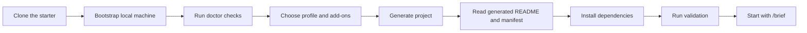

# SPEC-DRIVEN DEVELOPMENT STARTER PACK
### :rocket: Launch spec-driven, multi-agent projects with safer defaults.

An open source starter platform for teams and solo builders who want a practical way to begin new projects with clear workflow contracts, guided onboarding, portable setup, and room to grow into smarter orchestration over time.

SPEC-DRIVEN DEVELOPMENT STARTER PACK is based on the methodology introduced in GitHub's [spec-kit](https://github.com/github/spec-kit), with additional work here to expand that foundation into a more complete starter platform for onboarding, workflow governance, reusable profiles, and portable project setup.

[](https://github.com/williamceccon/spec-driven-development-starter-pack/releases)
[](LICENSE)
[](#supported-platforms)
[](#profile-catalog)

> :compass: **Repo-first workflow contract**  
> :sparkles: **Reusable profiles and add-ons**  
> :robot: **Agent-friendly prompts and governance**  
> :seedling: **Beginner-friendly onboarding and setup**

`idea` :arrow_right: `spec` :arrow_right: `plan` :arrow_right: `build`

---

## :card_index_dividers: Table of Contents

- [:toolbox: What It Is](#what-it-is)
- [:bulb: Why This Pack Exists](#why-this-pack-exists)
- [:rocket: Get Started](#get-started)
- [:seedling: Beginner-Friendly Onboarding](#beginner-friendly-onboarding)
- [:twisted_rightwards_arrows: Generated Flow](#generated-flow)
- [:open_file_folder: Profile Catalog](#profile-catalog)
- [:jigsaw: Add-on Catalog](#add-on-catalog)
- [:books: Curated Skills](#curated-skills)
- [:computer: Supported Platforms](#supported-platforms)
- [:gear: Supported Workspaces and Agents](#supported-workspaces-and-agents)
- [:open_file_folder: Repository Layout](#repository-layout)
- [:world_map: Roadmap](#roadmap)
- [:bookmark_tabs: Documentation](#documentation)
- [:page_facing_up: License](#license)

## :toolbox: What It Is

SPEC-DRIVEN DEVELOPMENT STARTER PACK helps you create new repositories with:

- a repo-first workflow contract
- guided project generation with beginner-safe defaults
- reusable profiles for common project shapes
- composable add-ons for databases and orchestration bundles
- generated docs, prompts, environment templates, and workflow governance

The stable source of truth in generated projects is:

- `workflow-pack.json`
- `.workflow-pack/manifest.json`
- `AGENTS.md`
- `CLAUDE.md`
- `.github/copilot-instructions.md`

Tool-specific prompts are generated from that contract instead of becoming the contract themselves.

This repository builds on the spec-driven method from GitHub's [spec-kit](https://github.com/github/spec-kit), then extends it with a fuller starter-pack experience for setup, profile composition, add-ons, and operational guidance.

## :bulb: Why This Pack Exists

Many new projects fail at the boring but critical setup layer: inconsistent environments, unclear GitHub setup, missing CI, no shared workflow rules, and too much hidden knowledge about how the team expects agents to work.

This starter pack is designed to reduce that friction by giving every new project:

- a portable core workflow layer
- a selected project profile
- optional add-ons for common capabilities
- curated repo-local fallback skills
- beginner-friendly instructions for environment, CI, dependencies, and first steps

## :rocket: Get Started

### :inbox_tray: 1. Clone the repository

```bash
git clone https://github.com/williamceccon/spec-driven-development-starter-pack.git
cd spec-driven-development-starter-pack
```

### :wrench: 2. Bootstrap your machine

Windows:

```powershell
./scripts/bootstrap.ps1
./scripts/install-workflow-pack.ps1
./scripts/doctor.ps1
```

macOS / Linux:

```bash
bash ./scripts/bootstrap.sh
bash ./scripts/install-workflow-pack.sh
bash ./scripts/doctor.sh
```

### :building_construction: 3. Generate a new project

Interactive:

```powershell
./scripts/new-project.ps1
```

```bash
bash ./scripts/new-project.sh
```

Non-interactive:

```powershell
./scripts/new-project.ps1 -Name demo-api -TargetPath C:\path\to\projects -Profile python-api -Addons postgres,core-workflow
```

```bash
bash ./scripts/new-project.sh --name demo-api --target-path "$HOME/projects" --profile python-api --addons postgres,core-workflow
```

### :footprints: 4. Follow the generated README

Inside the generated repository:

1. Read `README.md`
2. Copy `.env.example` to `.env`
3. Install dependencies using the generated commands
4. Run the first validation command
5. Start your workflow with `/brief "initial feature idea"`

## :seedling: Beginner-Friendly Onboarding

This pack is intentionally built for people using spec-driven development or agent-assisted development for the first time.

Generated projects include:

- a profile-specific `README.md`
- `.env.example`
- install, run, and validation commands
- a first-30-minutes checklist
- GitHub repository creation and push instructions
- optional GitHub Actions CI setup

If you are new to GitHub, env files, or dependency installation, the generated docs are designed to explain the basics instead of assuming them.

## :twisted_rightwards_arrows: Generated Flow



## :open_file_folder: Profile Catalog

### :white_check_mark: Ready now

| Profile | Family | Status | Best for |
| --- | --- | --- | --- |
| `python-library` | packages | ready | Python packages, SDKs, and reusable modules |
| `python-api` | apps | ready | Beginner-friendly Python API services |
| `nextjs-webapp` | apps | ready | Frontend-first web applications |
| `fullstack-web` | apps | ready | Web projects with backend and frontend coordination |
| `automation-agent` | specialized | ready | Automation, prompts, workflows, and agent-heavy repos |

### :compass: Planned roadmap

| Profile | Family | Status |
| --- | --- | --- |
| `node-api` | apps | planned |
| `typescript-library` | packages | planned |
| `cli-tool` | packages | planned |
| `data-science` | specialized | planned |
| `ml-service` | specialized | planned |

Each profile is responsible for starter structure, dependency commands, validation defaults, CI shape, env conventions, recommended skills, and GitHub notes.

## :jigsaw: Add-on Catalog

### :card_file_box: Database add-ons

- `sqlite`
- `postgres`
- `mysql`
- `mongodb`
- `redis`

### :robot: Orchestration bundles

- `core-workflow`
- `delivery`
- `quality`
- `maintenance`

Add-ons can contribute:

- `.env.example` entries
- local setup guidance
- validation notes
- GitHub Actions services
- migration or healthcheck conventions
- recommended or bundled skills

## :books: Curated Skills

The repository vendors a curated fallback set under `skills/` so generated projects do not depend entirely on machine-global state.

Bundled for the first ready profiles:

- core workflow: `brainstorming`, `writing-plans`, `verification-before-completion`
- GitHub maintenance: `gh-fix-ci`, `gh-address-comments`
- quality and debugging: `systematic-debugging`, `test-driven-development`, `requesting-code-review`
- web support: `playwright` for web-oriented profiles
- extension path: `skill-creator` so teams can create local project skills over time

Recommended orchestration bundles:

- `core-workflow`: `brainstorming`, `writing-plans`, `verification-before-completion`
- `delivery`: `subagent-driven-development`, `dispatching-parallel-agents`
- `quality`: `requesting-code-review`, `systematic-debugging`, `test-driven-development`
- `maintenance`: `gh-fix-ci`, `gh-address-comments`

See [`docs/SKILLS.md`](docs/SKILLS.md) for the current skill matrix by profile.

## :computer: Supported Platforms

- Windows
- macOS
- Linux

## :gear: Supported Workspaces and Agents

- Codex
- Claude Code
- OpenCode
- GitHub Copilot
- Antigravity

The project contract stays repo-centric so these surfaces can coexist without making the repository dependent on a single agent implementation.

Verified surfaces in this pack:

- `Codex`
- `Claude Code`
- `OpenCode`
- `GitHub Copilot`

Compatibility surface:

- `Antigravity` via `AGENTS.md` and `.agents/skills/` conventions until official vendor docs can be validated in this pack

## :open_file_folder: Repository Layout

- [`core`](core)
- [`profiles`](profiles)
- [`addons`](addons)
- [`scripts`](scripts)
- [`skills`](skills)
- [`docs`](docs)

## :world_map: Roadmap

Near-term priorities:

- deepen the ready profile implementations
- improve the guided `new-project` experience
- add more smoke coverage for profile and add-on combinations
- introduce a future-safe sync or upgrade path for generated repositories
- publish more polished releases, examples, and walkthroughs

## :bookmark_tabs: Documentation

- [`docs/SETUP.md`](docs/SETUP.md)
- [`docs/PROJECT_BOOTSTRAP.md`](docs/PROJECT_BOOTSTRAP.md)
- [`docs/SKILLS.md`](docs/SKILLS.md)
- [`skills/specify-workflow-pack/references/config.md`](skills/specify-workflow-pack/references/config.md)
- [`CHANGELOG.md`](CHANGELOG.md)

## :page_facing_up: License

[MIT](LICENSE)
