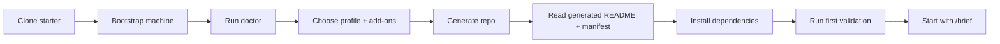

# Specify Workflow Starter

A public starter platform for **spec-driven development**, **first-time vibe coding**, and **multi-agent project setup**.

This repo helps you create new repositories with:

- a portable workflow contract
- guided onboarding for new users
- reusable project profiles
- composable add-ons such as databases and orchestration bundles
- generated docs, env files, prompts, and workflow governance

## Who This Is For

- developers trying spec-driven or agent-assisted development for the first time
- teams that want consistent repo setup across Windows, macOS, and Linux
- people who want a starter that explains GitHub, CI, env files, and first steps instead of assuming them

## Supported Platforms

- Windows
- macOS
- Linux

## Supported Workspaces / Agents

- Codex
- OpenCode
- GitHub Copilot
- Antigravity

The repo contract is **repo-first**. Tool-specific prompts are generated, but the stable source of truth is:

- `workflow-pack.json`
- `.workflow-pack/manifest.json`
- `AGENTS.md`

## Quick Start

### 1. Clone the starter

```bash
git clone <your-fork-or-this-repo-url>
cd specify-workflow-starter
```

### 2. Bootstrap your machine

Windows:

```powershell
./scripts/bootstrap.ps1
./scripts/install-workflow-pack.ps1
./scripts/doctor.ps1
```

macOS / Linux:

```bash
bash ./scripts/bootstrap.sh
bash ./scripts/install-workflow-pack.sh
bash ./scripts/doctor.sh
```

### 3. Create a project

Interactive:

```powershell
./scripts/new-project.ps1
```

```bash
bash ./scripts/new-project.sh
```

Non-interactive:

```powershell
./scripts/new-project.ps1 -Name demo-api -TargetPath C:\path\to\projects -Profile python-api -Addons postgres,core-workflow
```

```bash
bash ./scripts/new-project.sh --name demo-api --target-path "$HOME/projects" --profile python-api --addons postgres,core-workflow
```

### 4. Start the first feature

Inside the generated repo:

1. Read `README.md`
2. Copy `.env.example` to `.env`
3. Run the install and validation commands from the generated README
4. Start with `/brief "initial feature idea"`
5. Run `/workflow <slug>` only after `BRIEF.md` is approved

## Generated Flow



## Profile Catalog

### Ready now

| Profile | Family | Status | Notes |
| --- | --- | --- | --- |
| `python-library` | packages | ready | Reusable Python packages and libraries |
| `python-api` | apps | ready | Beginner-friendly backend/API starter |
| `nextjs-webapp` | apps | ready | Frontend-first web application starter |
| `fullstack-web` | apps | ready | Backend + frontend workflow shape |
| `automation-agent` | specialized | ready | Scripts, prompts, workflows, and automation repos |

### Planned

| Profile | Family | Status |
| --- | --- | --- |
| `node-api` | apps | planned |
| `typescript-library` | packages | planned |
| `cli-tool` | packages | planned |
| `data-science` | specialized | planned |
| `ml-service` | specialized | planned |

## Add-on Catalog

### Database add-ons

- `sqlite`
- `postgres`
- `mysql`
- `mongodb`
- `redis`

### Orchestration bundles

- `core-workflow`
- `delivery`
- `quality`
- `maintenance`

Add-ons can contribute:

- `.env.example` entries
- validation notes
- GitHub Actions services
- recommended skills
- beginner documentation notes

## Recommended Orchestration Skills

These are optional. The base starter should still feel approachable without them.

- `core-workflow`: `brainstorming`, `writing-plans`, `verification-before-completion`
- `delivery`: `subagent-driven-development`, `dispatching-parallel-agents`
- `quality`: `requesting-code-review`, `systematic-debugging`, `test-driven-development`
- `maintenance`: `gh-fix-ci`, `gh-address-comments`

## Curated Repo-Local Skills

The starter now vendors a curated fallback set under `skills/` for the first ready profiles instead of relying only on global machine state.

- core fallback: `brainstorming`, `gh-fix-ci`, `gh-address-comments`
- implementation quality: `writing-plans`, `verification-before-completion`, `systematic-debugging`, `test-driven-development`, `requesting-code-review`
- frontend support: `playwright` for the web-oriented profiles
- extension path: `skill-creator` so users can create their own project skills locally

## New To GitHub?

The generated README includes a section called **Create a GitHub repository and push**.

At a high level:

1. create an empty GitHub repo
2. initialize git if needed
3. commit the generated files
4. add the remote
5. push `main`
6. wait for the first CI run

## Repo Layout

- [`core`](core)
- [`profiles`](profiles)
- [`addons`](addons)
- [`scripts`](scripts)
- [`skills/specify-workflow-pack`](skills/specify-workflow-pack)

## Next Reading

- [`docs/SETUP.md`](docs/SETUP.md)
- [`docs/PROJECT_BOOTSTRAP.md`](docs/PROJECT_BOOTSTRAP.md)
- [`docs/SKILLS.md`](docs/SKILLS.md)
- [`CHANGELOG.md`](CHANGELOG.md)
